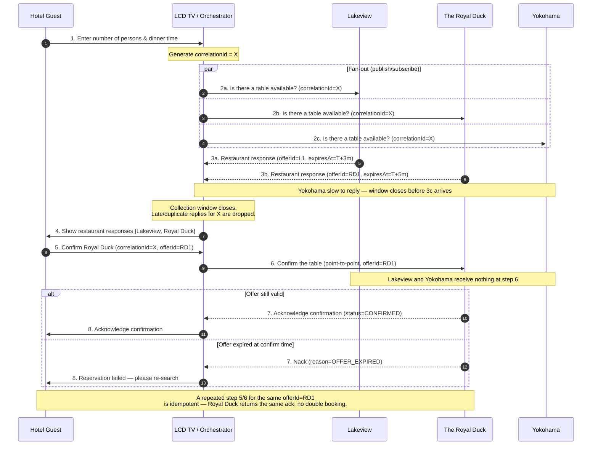

# Group 15 — Hotel Restaurant Reservation Messaging

## 1. Use Case Recap (per the reference diagram)

The reference diagram shows the base interaction: a **Hotel Guest** uses the **LCD TV** in the room to check availability at three restaurants — **Lakeview**, **The Royal Duck**, and **Yokohama** — then confirms one.

| Step (diagram) | Actor → Actor | Message |
|---|---|---|
| 1 | Guest → TV | Enter number of persons and dinner time |
| 2a | TV → Lakeview | Is there a table available? |
| 2b | TV → The Royal Duck | Is there a table available? |
| 2c | TV → Yokohama | Is there a table available? |
| 3a/3b/3c | Lakeview / Royal Duck / Yokohama → TV | Restaurant response |
| 4 | TV → Guest | Show restaurant responses |
| 5 | Guest → TV | Confirm Royal Duck |
| 6 | TV → The Royal Duck | Confirm the table |
| 7 | The Royal Duck → TV | Acknowledge confirmation |
| 8 | TV → Guest | Acknowledge confirmation |

This assignment's job is to take that **conceptual** flow and turn it into a proper **integration design**: choosing messaging patterns for steps 2/3 vs. steps 6/7, adding correlation so replies can be matched back to the right guest, and defining timeout/duplicate/expiry behaviour that the diagram doesn't show but any real implementation needs.

---

## 2. Messaging Pattern Choices

| Diagram step(s) | Pattern | Why |
|---|---|---|
| 1 (Guest → TV → Orchestrator) | **Request/Reply** (sync-style from the guest's point of view, async underneath) | The guest needs one bounded outcome (the offer list), even though it's assembled from several independent async replies. |
| 2a/2b/2c (TV → all 3 restaurants) | **Publish/Subscribe** on an `availability.request` topic | The *same* query ("is there a table?") must reach all three restaurants at once; the orchestrator doesn't need to know or hard-code which/how many restaurants are listening. |
| 3a/3b/3c (restaurants → TV) | **Point-to-point** via a shared `availability.reply` queue | Each restaurant's answer is consumed by exactly one thing — the aggregator — not broadcast further. |
| 6 (TV → The Royal Duck only) | **Point-to-point** on `reservation.confirm.<restaurantId>` | Exactly one restaurant must act on the confirmation. Broadcasting step 6 to Lakeview and Yokohama too (as pub/sub would) risks them holding or double-booking a table nobody asked them to hold. |
| 7 (Royal Duck → TV) | **Point-to-point** via `reservation.ack` queue | Single consumer (orchestrator) finalizes the guest-facing state. |

**Rule of thumb:** pub/sub when *every* recipient must see the same message (fan-out, step 2); point-to-point when *exactly one* recipient must act (step 6 — this is the step in the diagram most students get wrong by treating it as another broadcast).

---

## 3. Correlation, Timeout, and Duplicate Handling

### Correlation
- A `correlationId` (UUID v4) is generated by the orchestrator at **step 1**, when the guest's request leaves the TV.
- It's stamped into every subsequent message: steps 2a–2c, 3a–3c, 4, 6, and 7.
- The aggregator buckets incoming replies (3a/3b/3c) by `correlationId` until its collection window closes.
- A separate `offerId` (UUID, minted by each restaurant in its 3a/3b/3c reply) identifies *that specific offer* — e.g. Royal Duck's offer gets its own `offerId` distinct from Lakeview's — so step 5 ("confirm Royal Duck") unambiguously references one offer, and step 6 only reaches Royal Duck, never Lakeview or Yokohama.

### Timeout behaviour
- The orchestrator opens a **collection window** (e.g. 8 seconds) per `correlationId` right after step 2a/2b/2c goes out.
- Restaurants replying within the window (3a/3b/3c) have their offers included at step 4.
- A restaurant that doesn't reply in time is simply **left out** of step 4 — no error to the guest, the flow degrades gracefully rather than blocking on the slowest restaurant (e.g. if Yokohama is slow, the guest still sees Lakeview and Royal Duck).
- If **none** of the three reply in time, the orchestrator returns "no availability" at step 4 instead of hanging indefinitely.
- A reply that arrives *after* the window has closed is matched by `correlationId`, recognized as past-window, logged, and **discarded** — never surfaced as a stale, unconfirmable offer.

### Duplicate behaviour
- **Duplicate availability reply** (e.g. broker redelivers Lakeview's 3a message): deduped on `(correlationId, restaurantId)` — first reply wins, later duplicate dropped.
- **Duplicate confirmation** (guest double-taps "Confirm Royal Duck" at step 5, or the TV retries step 6 after a network blip): Royal Duck's handler treats `offerId` as an **idempotency key**. A repeated step 6 for the same `offerId` returns the *same* step-7 acknowledgement as the first — it does not create a second reservation.
- **Confirmation of an expired offer**: step 6 is rejected with `reason=OFFER_EXPIRED`; the guest is routed back to step 1/2 to re-search.

### Expiry
- Each restaurant sets its own `expiresAt` in its 3a/3b/3c reply (Lakeview's hold time may differ from Royal Duck's or Yokohama's kitchen/table policy).
- Enforced two ways, for defense in depth:
  1. **Broker TTL** on the offer message, so an expired offer can't physically be replayed from the queue.
  2. **Explicit check** at step 6 — Royal Duck (or the orchestrator, before forwarding) compares `now()` to `expiresAt` and rejects if past.

---

## 4. Architecture

```
                 ┌───────────────────────────┐
                 │   Reservation Orchestrator │
                 └───────────────────────────┘
                     ▲                    │
   (1) reserve.request│                    │(2a/2b/2c) publish
    correlationId=X   │                    ▼
┌──────────┐    ┌─────┴──────┐     ┌──────────────────────┐
│  LCD TV  │───▶│  Request/  │     │ Topic: availability.  │
│ (Guest)  │    │  Reply API │     │ request  (pub/sub)    │
└──────────┘    └─────┬──────┘     └──────────┬─────────────┘
     ▲                │                       │ fan-out
     │ (4) offers      │ (3a/3b/3c) aggregate  ▼
     │  [correlated]   │            ┌─────────────────────────┐
     │                └───────────▶│ Queue: availability.reply │◀── Lakeview
     │                             │        (point-to-point)   │◀── The Royal Duck
     │                             └─────────────────────────┘◀── Yokohama
     │
     │ (5) guest confirms Royal Duck
     ▼
┌──────────────────────────────┐        ┌────────────────────────┐
│ Queue: reservation.confirm.  │──(6)──▶│  The Royal Duck only    │
│   <restaurantId>             │        │  (point-to-point)       │
│   (point-to-point)           │        └───────────┬─────────────┘
└──────────────────────────────┘                    │
                                                       │ (7) ack/nack
                                                       ▼
                                        ┌─────────────────────────┐
                                        │ Queue: reservation.ack   │
                                        │   (point-to-point)       │
                                        └───────────┬─────────────┘
                                                       │
                                                       ▼
                                          (8) back to Guest via TV
```

---

## 5. Sequence Diagram



---

## 6. Message Contracts

### 6.1 Common Headers (every message)

| Header | Type | Example | Purpose |
|---|---|---|---|
| `correlationId` | UUID | `9f1c...-...` | Ties every message in one guest's reservation flow together |
| `messageId` | UUID | `a3b2...` | Unique per physical message; used for dedup |
| `messageType` | string | `AvailabilityRequest` | Routing / deserialization hint |
| `timestamp` | ISO-8601 | `2026-09-18T10:15:30Z` | Emit time |
| `replyTo` | string | `availability.reply` | Where responder should send its reply |
| `ttlMs` | integer | `8000` | Broker-level expiry for the message |

### 6.2 AvailabilityRequest (steps 2a/2b/2c — Orchestrator → Topic)

```json
{
  "messageType": "AvailabilityRequest",
  "correlationId": "9f1c2e3a-1111-4a2b-9c3d-000000000001",
  "messageId": "b7e1...",
  "timestamp": "2026-09-18T10:15:30Z",
  "replyTo": "availability.reply",
  "ttlMs": 8000,
  "payload": {
    "partySize": 4,
    "requestedTime": "2026-09-18T19:30:00Z",
    "hotelGuestId": "GUEST-4821"
  }
}
```

### 6.3 AvailabilityOffer (steps 3a/3b/3c — Restaurant → Reply Queue)

```json
{
  "messageType": "AvailabilityOffer",
  "correlationId": "9f1c2e3a-1111-4a2b-9c3d-000000000001",
  "messageId": "c8f2...",
  "timestamp": "2026-09-18T10:15:31Z",
  "payload": {
    "offerId": "OFFER-RD1",
    "restaurantId": "REST-ROYALDUCK",
    "restaurantName": "The Royal Duck",
    "available": true,
    "proposedTime": "2026-09-18T19:30:00Z",
    "expiresAt": "2026-09-18T10:20:31Z",
    "holdDurationSec": 300
  }
}
```

### 6.4 OfferList (step 4 — Orchestrator → TV/Guest)

```json
{
  "messageType": "OfferList",
  "correlationId": "9f1c2e3a-1111-4a2b-9c3d-000000000001",
  "payload": {
    "offers": [
      { "offerId": "OFFER-L1",  "restaurantName": "Lakeview",       "expiresAt": "2026-09-18T10:18:31Z" },
      { "offerId": "OFFER-RD1", "restaurantName": "The Royal Duck",  "expiresAt": "2026-09-18T10:20:31Z" }
    ],
    "noOfferReceived": ["Yokohama"]
  }
}
```

### 6.5 ConfirmationRequest (step 6 — Orchestrator → Confirm Queue → Royal Duck only)

```json
{
  "messageType": "ConfirmationRequest",
  "correlationId": "9f1c2e3a-1111-4a2b-9c3d-000000000001",
  "messageId": "d9a3...",
  "timestamp": "2026-09-18T10:16:05Z",
  "idempotencyKey": "OFFER-RD1",
  "payload": {
    "offerId": "OFFER-RD1",
    "restaurantId": "REST-ROYALDUCK",
    "guestId": "GUEST-4821",
    "partySize": 4
  }
}
```

### 6.6 ConfirmationAck / Nack (step 7 — Royal Duck → Orchestrator)

```json
{
  "messageType": "ConfirmationAck",
  "correlationId": "9f1c2e3a-1111-4a2b-9c3d-000000000001",
  "payload": {
    "offerId": "OFFER-RD1",
    "status": "CONFIRMED",
    "reservationRef": "RD-20260918-1930-04"
  }
}
```

```json
{
  "messageType": "ConfirmationNack",
  "correlationId": "9f1c2e3a-1111-4a2b-9c3d-000000000001",
  "payload": {
    "offerId": "OFFER-RD1",
    "status": "REJECTED",
    "reason": "OFFER_EXPIRED"
  }
}
```

---

## 7. Test Cases

| # | Scenario | Setup | Expected Behaviour |
|---|---|---|---|
| T1 | **Happy path** | Lakeview, Royal Duck, Yokohama all reply within window | Guest sees all 3 offers at step 4, all correlated to the same `correlationId`; guest confirms Royal Duck; only Royal Duck receives step 6. |
| T2 | **Single restaurant timeout** | Yokohama (3c) doesn't reply within 8s window | Step 4 shows only Lakeview and Royal Duck; Yokohama's late reply, if it arrives after the window, is logged and discarded. |
| T3 | **Total timeout (no replies)** | None of the 3 restaurants reply in window | Orchestrator returns "no availability" at step 4 instead of hanging. |
| T4 | **Expired offer at confirm time** | Guest confirms Royal Duck (step 5) after its `expiresAt` has passed | Step 6 gets a `ConfirmationNack` with `reason=OFFER_EXPIRED`; step 8 tells the guest to re-search. |
| T5 | **Duplicate confirmation (retry)** | Step 6 for `offerId=RD1` sent twice (e.g. TV retries after a dropped ack) | Royal Duck treats `offerId` as an idempotency key; the second request returns the identical ack as the first; only one reservation is created. |
| T6 | **Duplicate availability reply** | Broker redelivers Lakeview's step-3a message | Aggregator dedupes on `(correlationId, restaurantId)`; only the first Lakeview offer is shown; duplicate dropped. |
| T7 | **Confirmation reaches only the chosen restaurant** | Guest confirms Royal Duck at step 5 | Step 6 is addressed only to `reservation.confirm.royalduck`; Lakeview and Yokohama receive nothing. |
| T8 | **Correlation mismatch** | A malformed/late reply arrives with a `correlationId` the orchestrator has already closed out | Message is rejected/logged as orphaned; never merged into any active or past guest session. |
| T9 | **Broker TTL enforcement** | Offer message TTL (broker-level) is set ≤ `expiresAt` | The message becomes unroutable once TTL passes, even if the app-level expiry check were skipped — defense in depth confirmed. |

---

## 8. Summary of Pattern Justification

- **Publish/Subscribe** fits steps 2a/2b/2c because the same "is there a table?" query goes to all three restaurants identically, and the orchestrator doesn't need to hard-code who's listening.
- **Point-to-point** fits step 6 because exactly one restaurant (whichever the guest picked at step 5) must act — this is the step the original diagram implies but a naive pub/sub implementation would get wrong, risking Lakeview or Yokohama also holding a table nobody asked for.
- **Request/Reply** at the Guest↔TV boundary (steps 1 and 4/8) gives the guest one coherent interaction, while pub/sub + point-to-point plumbing underneath handles the actual fan-out/fan-in.
- **correlationId** threads steps 1 through 8 into a single logical transaction; **offerId** disambiguates which restaurant's specific offer the guest picked at step 5, which is what makes step 6 point-to-point (and idempotent) possible in the first place.
MDEOF
echo "done"
Output

done
